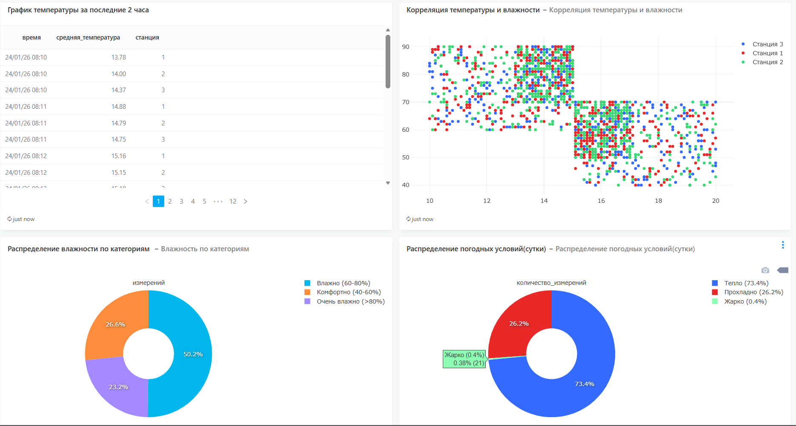
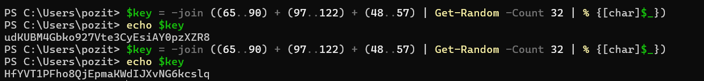

## Система сбора и анализа данных погодной станции

End-to-end система для генерации, хранения и визуализации данных с виртуальной погодной станции. Я выбрала(из предложенных вариантов) погодную станцию

## Основное замечание к работе было связано с подключением редаша вручную, я это исправила
Настроила Docker Compose на основе официальной документации: скачала файлы `compose.yaml` и `setup.sh` с getredash/setup, адаптация compose.yaml для Windows, создала `.env.redash` файла 
Использование официальной архитектуры Redash (server, scheduler, workers), настройка 2х бд -  для redash и для погоды

Также упрощен генератор 

## Подключение к Redash

1. http://localhost:5000
2. База: weather_db
3. Пользователь: weather_user
4. Пароль: weather_pass

генерация ключей:

