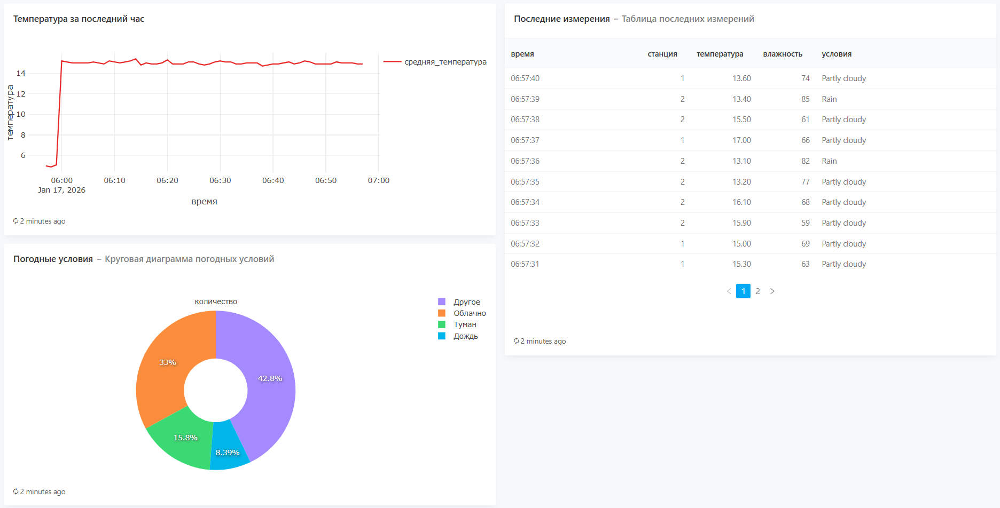

## Система сбора и анализа данных погодной станции

End-to-end система для генерации, хранения и визуализации данных с виртуальной погодной станции.

## Компоненты системы
1. **Генератор данных** - Python-скрипт, создающий реалистичные погодные данные
2. **PostgreSQL** - база данных для хранения измерений
3. **Redash** - инструмент для визуализации данных и создания дашбордов
docs: add comprehensive setup and usage instructions

### Я выбрала(из предложенных вариантов) погодную станцию
### Описание:
- Генерирует данные с виртуальных метеостанций
- Поля: температура, влажность, давление, скорость ветра, направление ветра, погодные условия
- Временные метки и идентификаторы станций

## Этапы работы над проектом

1. Подготовка и настройка окружения: установка Docker и Docker Compose, создание структуры проекта в PyCharm, инициализация git-репозитория

2. Разработка генератора данных: написание генератора погодных данных, реализация функций для генерации температруы, влажности, давления и данных о ветре; настройка подключения к PostgreSQL

3. Настройка базы данных: создание Docker-образа PostgreSQL, определение структуры таблицы для хранения данных, настройка индексов для запросов, подключение

4. Docker: создание Dockerfile для генератора данных, написание docker-compose.yml, настройка зависимостей

5. Redash: добавление Redash в docker-конфигурацию и подключение к PostgreSQL

6. Создание визуализаций: написание SQL-запросов для анализа данных, создание графиков в Redash, построение дашборда

## Подключение к Redash

1. http://localhost:5000
2. База: weather_db
3. Пользователь: weather_user
4. Пароль: weather_pass

